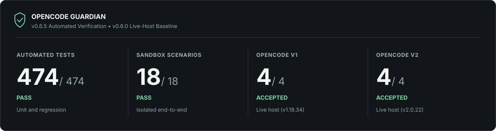

# Verification & Live Acceptance Report

**OpenCode Guardian · v0.5.0 · 03 October 2026**

[← Documentation](README.md) · [Project README](../README.md) · [Security benchmark](security-benchmark.md) · [CI workflow](../.github/workflows/ci.yml)



> **Evidence snapshot.** This report records the acceptance results supplied for commit [`b86b08e53ae6d9a0101db198bfe394ebdd19ebdb`](https://github.com/huseyincig/opencode-guardian/commit/b86b08e53ae6d9a0101db198bfe394ebdd19ebdb). These are historical, commit-specific results—not a claim that every future commit or environment has been tested. “PASS” below denotes a reported result within the stated test scope, not a formal security certification.

## At a glance

| Evidence layer | Result | Source / method |
| :--- | ---: | :--- |
| Automated unit and regression suite | **374 / 374 PASS** | `npm test` on the audited commit |
| Isolated end-to-end sandbox | **18 / 18 PASS** | `sandbox/comprehensive-test.mjs` |
| Sandbox smoke exercise | **PASS** | `sandbox/smoke-test.mjs` |
| V1 acceptance criteria | **4 / 4 PASS** | OpenCode V1 QA report; host-adapter and live terminal checks |
| V2 acceptance criteria | **4 / 4 PASS** | OpenCode V2 QA report; live host sessions and isolated checks |
| V2 supplemental security decision matrix | **35 / 35 PASS** | QA-reported static inputs; not destructive OS execution |
| Production dependency audit | **0 reported vulnerabilities** | `npm audit --omit=dev` |
| Full development dependency audit | **12 high advisories** | Known upstream development-only dependency chain |

The automated tests and sandbox counts describe separate suites. The V1 and V2 acceptance totals are four criteria **per host**, not eight additional automated tests. The 35 security cases are a supplementary QA matrix and must not be added to the 374-test runner count.

## 1. Audited environments

| Item | OpenCode V1 | OpenCode V2 |
| :--- | :--- | :--- |
| Host reported in final acceptance | OpenCode `1.18.34` | OpenCode `2.0.22` |
| Platform | Linux x86_64 | Linux x86_64 |
| Runtime | Node.js `24.21.0` | Node.js `24.13.1`; Bun `1.3.10` |
| Guardian package | `0.5.0` | `0.5.0` |
| Git baseline | `b86b08e` | `b86b08e` |
| Adapter interface | `@opencode-ai/plugin` | `@opencode/plugin` |
| Acceptance disposition | **4 / 4 PASS** | **4 / 4 PASS** |

All reported QA work used disposable or isolated environments and did not modify production code, create a release, or require destructive changes to an existing user workspace.

## 2. Acceptance matrix

| Acceptance criterion | V1 | V2 | What was evidenced |
| :--- | :---: | :---: | :--- |
| Completed-turn detection and remediation | PASS | PASS | One remediation; repeat-turn or loop protection |
| Pre-execution security interception | PASS | PASS | Test targets preserved; before/after SHA-256 identical |
| TUI and live status presentation | PASS | PASS | Sidebar integration, counters, and theme behavior |
| Teardown and lifecycle | PASS | PASS | Watchers / subscriptions disposed; reload checks |

**Evidence levels matter:** V2's remediation and tool interception were reported from live model/host sessions. The V1 completed-turn example used the real SDK data model with **simulated assistant content**; the fallback's completion logic was exercised through six automated integration/regression cases. V1's terminal/TUI and sandbox security checks were reported separately. Do not interpret the V1 SDK-shaped simulation as a recorded live LLM remediation.

### 2.1 Completed-turn review

**V1 — host compatibility and duplicate protection**

- `createV1TurnWatcher` polls only a newly prompted session when the native `session.idle` event is lost. A `busy` or `retry` state cannot trigger inspection.
- Inspection requires the latest assistant message to have `time.completed` and the same completed message to remain stable across **two idle observations**.
- A delivered native idle event cancels the fallback. Session deletion and `dispose()` also stop outstanding watchers.
- A completed-turn SDK-model exercise generated one remediation for a stubbed implementation; a repeated idle event generated **zero additional remediations**.
- All **six** regression checks in [`tests/v1-idle-fallback.test.mjs`](../tests/v1-idle-fallback.test.mjs) passed.

**V2 — live completed-turn remediation**

- The QA report records a real OpenCode session (`ses_efc7a7ad0ffew38R443lo4pKcz`) in which a rule violation produced a Guardian remediation prompt.
- The agent consumed that prompt, provided a follow-up response, and the subsequent remediation response was classified to prevent another cycle.
- This validates the reported live remediation path for the exercised rule; it does not prove that every possible rule or model response has been tested.

### 2.2 Pre-execution security: file integrity proof

Only disposable fixture files were used. The recorded host/interception results are:

| Property | V1 fixture | V2 fixture |
| :--- | :--- | :--- |
| Isolated location | `/tmp/guardian-security-test/disposable-target.txt` | `/root/guardian_v2_audit_sandbox/test-project/disposable_target.txt` |
| Blocked tool requests | **4** | **1** |
| Checks exercised | `rm -rf`, backtick substitution, `$(printf rm)`, `find -delete` | `rm` via live host shell tool |
| Guardian outcome | `destructive-command` | `destructive-command` |
| SHA-256 before | `1c3c3ef3fcd8d528b9d75b3644f1c327299f1961ee4ee3ef5c88019a1ec09dd6` | `3ce42425d0e843a5290dd4508665dabf12290fbb89128214f234d355430f55cf` |
| SHA-256 after | **identical to before** | **identical to before** |
| Recorded telemetry | 4 `preflight-blocked` events | `preflight-blocked` for the relevant session |

For the V2 live session (`ses_efc7dd62cffegzj31e6T4zhXfM`), the QA report also recorded `providerCall.executed: false` and session fingerprint `e7367cf893e8079e`. Its redacted telemetry contained both a blocked unsafe request and a later allowed tool request. For V1, the report described host pre-execution hook exercises and fixture checks; it did not include an independently archived live model transcript.

The matching hashes demonstrate that **the specific test fixtures did not change**. This is a bounded interception result—not proof that Guardian recognizes every shell construct or protects every file.

### 2.3 Shell, credential, and false-positive regression

The audited baseline includes dedicated cases in [`tests/v1-v2-security-fixes.test.mjs`](../tests/v1-v2-security-fixes.test.mjs), as well as existing [preflight](../tests/preflight.test.mjs) and [GuardFall-style](../tests/guardfall-regression.test.mjs) regressions.

| Tested behavior | Expected / reported outcome |
| :--- | :--- |
| Literal backtick substitution producing `rm` in command position | `destructive-command` |
| Unresolved dynamic executable names | `uninspectable-shell-input` |
| Opaque decoded shell pipelines | `opaque-shell-execution` |
| Read-only tools and passive quoted command examples | Allowed |
| Explicitly configured custom shell tools | Included in preflight checks |
| Documented local database examples in sample/template files | Allowed |
| Real-looking tokens or remote database credentials, including sample files | Blocked |
| Real credentials after an allowed placeholder in the same file | Blocked |

The supplemental V2 QA matrix reported **35/35 expected decisions** on static inputs. It did not run 35 destructive commands against an operating system.

### 2.4 TUI and lifecycle

**V1:** The QA report recorded a `sidebar_content` registration at order `600` in a tmux terminal, with status counters, theme bindings and disabled-mode behavior. The host-adapter checks exercised `dispose()` and verified that the session watcher stops. The report did not include an archived screenshot or pixel-diff artifact.

**V2:** The QA report recorded a live terminal sidebar that expands and collapses, a **2.5-second** reactive status refresh, and counts observed during testing (`inspected: 7`, `blocked: 2`, `warnings: 1`, `remediations: 14`, `errors: 0`). Teardown tests covered event-stream aborts, disposal of registered hooks, and bounded retries. No crash or unhandled rejection was observed in the reviewed logs; this is not a proof that memory leaks are impossible.

An independent Node-only OpenTUI/FFI renderer check was unavailable in an earlier QA environment. That limitation is distinct from the reported functioning TUI **inside the V2 OpenCode host**.

## 3. Build, distribution, and known dependency findings

The audited baseline passed `npm ci`, TypeScript typecheck, automated tests, sandbox smoke and comprehensive exercises, and `npm pack --dry-run`. The package check recorded **72 files**, including the compiled V1 watcher and the TUI entrypoints.

**Production dependencies:** `npm audit --omit=dev` reported **zero known advisories** during the audit.

**Development dependencies:** The full audit reported **12 high-severity findings** in the upstream SDK/development dependency graph, linked in the project audit policy to [`GHSA-ch52-4w7c-c8xp`](https://github.com/advisories/GHSA-ch52-4w7c-c8xp) and `http-cache-semantics`. They are **not resolved** by the successful runtime audit. [`scripts/check-dev-audit.mjs`](../scripts/check-dev-audit.mjs) and the [CI workflow](../.github/workflows/ci.yml) retain visibility and enforce the project's documented exception boundary.

**Security boundary:** Strict preflight is **opt-in**. Only recognized shell tools and explicitly configured custom shell tools are inspected. Post-turn review cannot reverse a tool action. Guardian is neither a full shell interpreter nor an alternative to host permissions, isolation, or human review.

## 4. Reproduce the baseline checks

Run in the repository with a compatible Node.js runtime:

```bash
npm ci
npm run typecheck
npm test
node sandbox/smoke-test.mjs
node sandbox/comprehensive-test.mjs
npm audit --omit=dev
node scripts/check-dev-audit.mjs
npm pack --dry-run
```

The six V1 compatibility tests and security-fix regressions are included in `npm test`. See [`.github/workflows/ci.yml`](../.github/workflows/ci.yml) for the automated CI sequence and Node matrix. Real host/TUI acceptance additionally requires a supported interactive OpenCode installation and a disposable sandbox; `npm test` alone does not establish that result.

For the older in-memory detector benchmark, see [Security Benchmark](security-benchmark.md). For rule-to-risk coverage and architecture, see [OWASP Agentic Top 10 mapping](owasp-agentic-top10-2026.md) and [Task Contract & Adapter Architecture](task-contract-v1-v2.md).

---

**Disposition:** The supplied V1 and V2 QA reports record **4/4 acceptance criteria passing on each host** for `b86b08e`, with the evidence limits described above. No additional functional code change was required by those results. Re-run acceptance when changing the runtime, security rules, hook implementations, or host integration.
